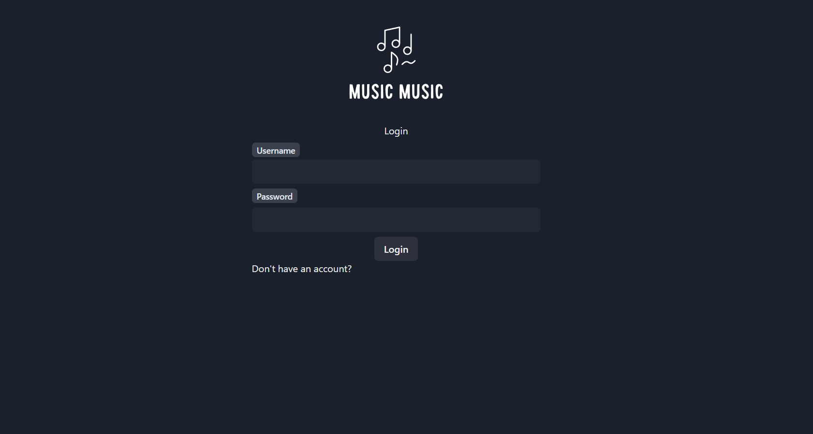
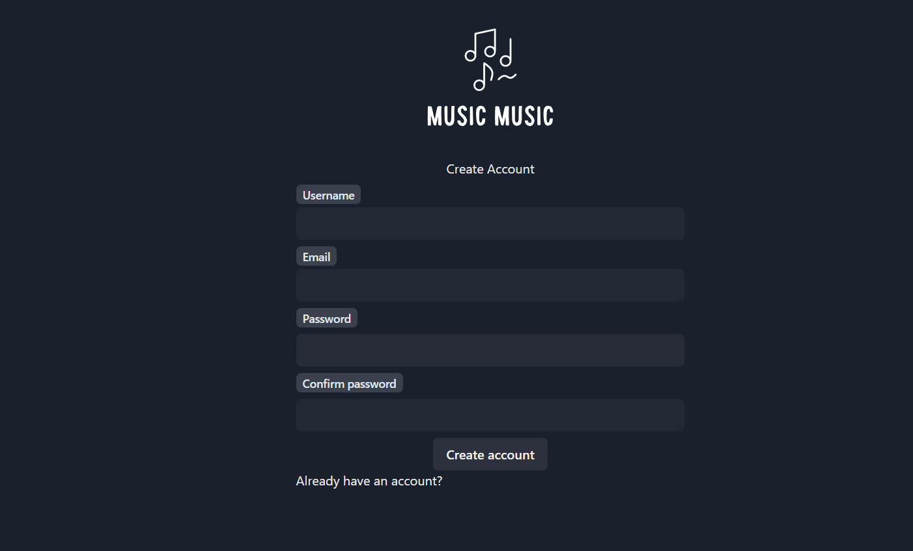
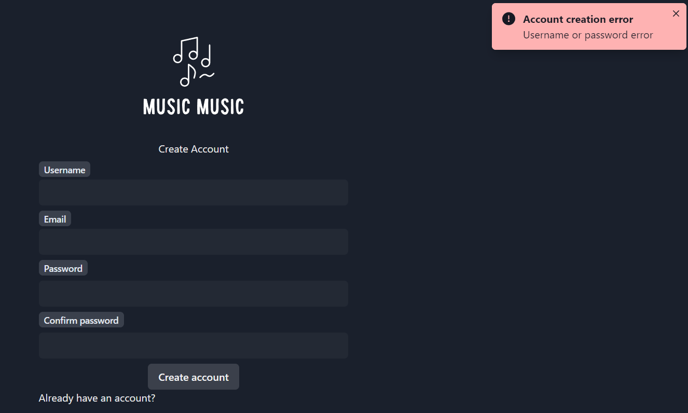
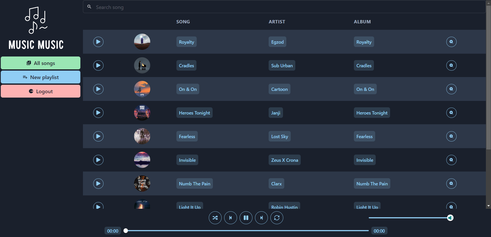
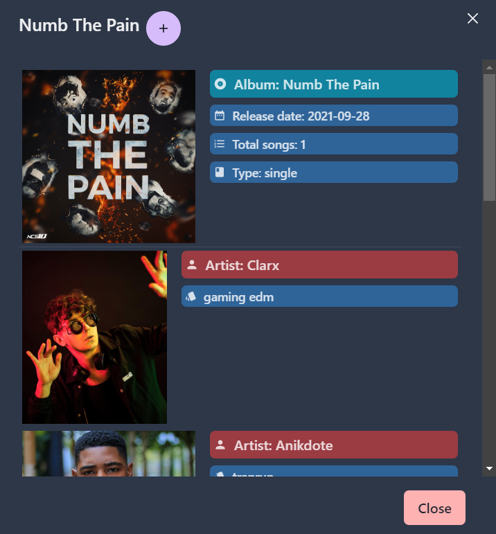
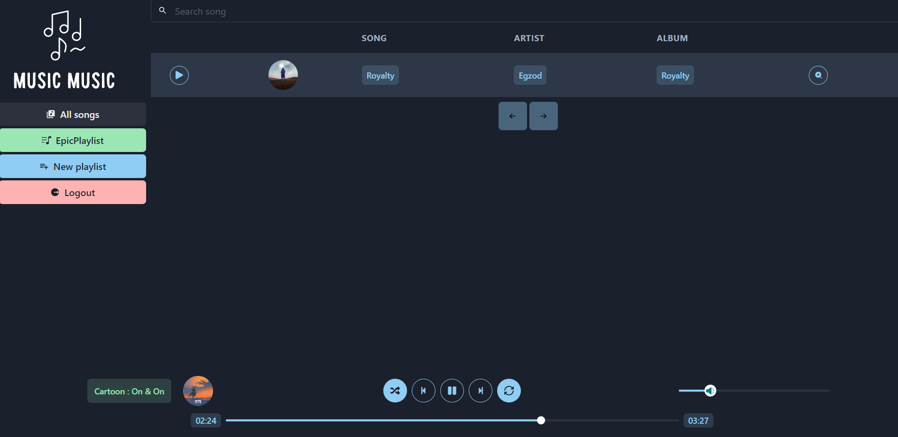

# Web Music Player

## Build with

- React
- Django rest

## Use
- Install requirements.txt on local computer
- Run migrations
- Create .env file with spotify api credentials (CLIENT_ID, CLIENT_SECRET)
- python manage.py runserver

## Features
- Download spotify music with spotify song link (managment/commands)
- Create account
- Login
- Create playlists
- Search song
- See song details
- Feedback toast info system

# Running proyect

## Video
[Video demostration](https://youtu.be/SvrwKZk7tT4)

## Login

## Create account

## Fedback toast

## Music player

## Song details

## Custom playlists

